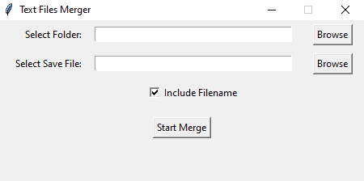

# Text-Files-Merger

## Brief

This tool provides a simple graphical interface to merge the contents of multiple text files into a single file. Users can select a source folder containing the text files to be merged and specify the location to save the merged file. Additionally, there's an option to include filenames as separators between sections in the merged file.

## Snapshot



## Workflow Explanation

1. Select the source folder containing the text files to be merged.
2. Choose the save location for the merged file.
3. Optionally, check the box to include filenames as separators.
4. Click the "Start Merge" button to start the merging process.
5. Once the merging is complete, the merged file will be available at the specified location.

## Setup Instructions

### Using Python Virtual Environment

1. Create a Python virtual environment:
   ```bash
   python -m venv local
   ```
2. Install dependencies:
   ```bash
   .\local\Scripts\pip install tqdm==4.66.2
   ```
3. Run the tool:
   ```bash
   .\local\Scripts\python main.py
   ```

### Using Executables

1. Download the pre-built executable from the releases section.
2. Double-click the executable to run the tool.

## Notes

The application has a terminal showing backend progress.
